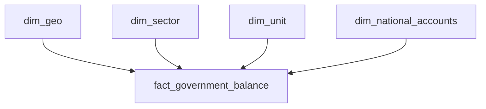

# Fabric Eurostat DBT Project

This repository demonstrates using [dbt](https://www.getdbt.com/) with **Microsoft Fabric** to transform data sourced from **Eurostat**. It is based on:

- [dbt-labs/jaffle-shop-classic](https://github.com/dbt-labs/jaffle-shop-classic)  
- Microsoft’s tutorial: [Set up dbt with Microsoft Fabric](https://learn.microsoft.com/en-us/fabric/data-warehouse/tutorial-setup-dbt)

While some configurations have been updated for local environment needs and Eurostat data ingestion, the core structure follows the Jaffle Shop + Fabric tutorial examples.

## Project Overview

1. **Data Source**  
   - Eurostat APIs or Lakehouse tables that contain Eurostat data.

2. **Three Schemas**  
   - **Source**: Raw or lightly processed Eurostat data.  
   - **Staging**: Refined/cleaned tables for internal use.  
   - **Mart**: Final dimensional tables and fact tables, ready for reporting/analytics.

3. **dbt Orchestration**  
   - We use dbt to define, build, and test transformations within Microsoft Fabric’s Data Warehouse.

Below is a simple star schema diagram for the final model in the **Mart** layer:



## Requirements

1. **Python 3.7+**  
   - Check with `python --version` or `python3 --version`.

2. **Microsoft ODBC Driver for SQL Server**  
   - [Windows instructions](https://learn.microsoft.com/sql/connect/odbc/download-odbc-driver-for-sql-server).  
   - [macOS & Linux instructions](https://learn.microsoft.com/sql/connect/odbc/).

3. **dbt-fabric**  
   - Install via:  
     ```bash
     pip install dbt-fabric
     ```
   - This adapter connects dbt to Microsoft Fabric Warehouses.

4. **Azure CLI** (optional)  
   - Needed if you use `authentication: CLI` in your dbt profile.  
   - See [Azure CLI Installation](https://learn.microsoft.com/cli/azure/install-azure-cli).  
   - After install, run `az login` so dbt can access your credentials.

When finished installing, confirm:

```bash
dbt --version
az --version
```

> *Tip:* In the future, you could package these dependencies in a Docker or Conda environment for simpler setup.

## Setup

1. **Clone this repository**:
   ```bash
   git clone https://github.com/YourOrg/fabric-eurostat-dbt.git
   cd fabric-eurostat-dbt
   ```

2. **Configure `profiles.yml`** (in `~/.dbt/` or another location).  
   Make sure to set:
   - `database` = Your Fabric Warehouse (e.g., `DWH_Eurostat`).  
   - `host` = Your Fabric endpoint (e.g., `<server>.datawarehouse.fabric.microsoft.com`).  
   - `schema` = `""` (or your default schema, if you prefer).  
   - `authentication` = `CLI`, `interactive`, or other supported method (depending on your environment).

3. **Check `dbt_project.yml`**  
   - Ensure your model folders (e.g. `Source`, `Staging`, `Mart`) match the schema naming logic you desire.  
   - By default, anything in `models/Source` builds in `[Source].table_name`, etc.

## Usage

1. **Test the Connection**:
   ```bash
   dbt debug
   ```
   This verifies dbt can reach Microsoft Fabric with the credentials in your profile.

2. **Run Models**:
   ```bash
   dbt run
   ```
   dbt will build or update the tables/views defined in `models/`.  
   The results appear in the schemas specified in `dbt_project.yml`.

3. **Run Tests**:
   ```bash
   dbt test
   ```
   Any assertions or relationships defined in `tests/` or within your models will be executed, helping validate data integrity.

## Contributing / Issues

- Please [open an issue](https://github.com/YourOrg/fabric-eurostat-dbt/issues) if you encounter problems or have questions.
- Pull requests are welcome, whether for new features, improved docs, or bug fixes.

## Credits

- **dbt-labs** for [jaffle-shop-classic](https://github.com/dbt-labs/jaffle-shop-classic).  
- **Microsoft** for the [Fabric dbt tutorial](https://learn.microsoft.com/en-us/fabric/data-warehouse/tutorial-setup-dbt).  
- **Eurostat** for providing open access to valuable datasets.

---

**Happy analyzing Eurostat data with Microsoft Fabric + dbt!**
