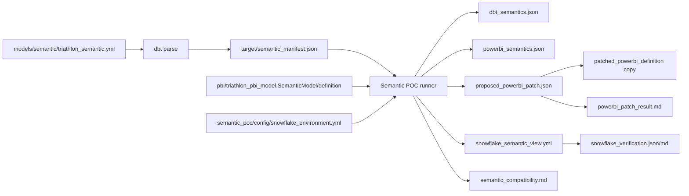
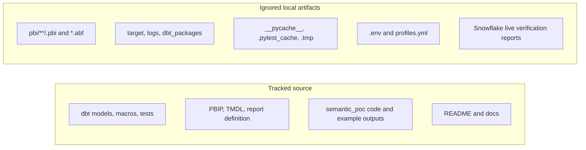
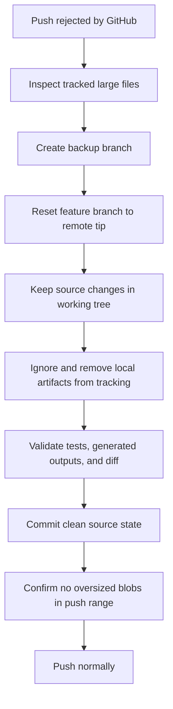

# Triathlon Semantic Contract POC

This repository is a small proof of concept for keeping triathlon analytics semantics aligned across three surfaces:

- dbt Semantic Layer YAML as the canonical source of business meaning.
- Power BI TMDL metadata as an extraction target with an opt-in safe metadata patch copy workflow.
- Snowflake Semantic View YAML as generated review output, with optional account verification and explicit deployment.

The local POC does not require Power BI or Snowflake credentials. It reads the checked-in dbt and Power BI model files, generates review artifacts under `semantic_poc/output/`, and reports where the platforms match or drift. The optional Power BI patch command writes to a copied definition folder by default. Snowflake verification and deployment are separate opt-in commands.

## Architecture


```mermaid
flowchart LR
    A[models/semantic/triathlon_semantic.yml] --> B[dbt parse]
    B --> C[target/semantic_manifest.json]
    C --> D[Semantic POC runner]
    E[pbi/triathlon_pbi_model.SemanticModel/definition] --> D
    F[semantic_poc/config/snowflake_environment.yml] --> D
    D --> G[dbt_semantics.json]
    D --> H[powerbi_semantics.json]
    D --> I[proposed_powerbi_patch.json]
    I --> L[patched_powerbi_definition copy]
    I --> M[powerbi_patch_result.md]
    D --> J[snowflake_semantic_view.yml]
    D --> K[semantic_compatibility.md]
    J --> N[snowflake_verification.json/md]
```

`models/semantic/triathlon_semantic.yml` is the only manually maintained semantic contract for this POC. Platform-specific mappings live in each public metric's `config.meta` block.

## Prerequisites

- Python 3.10 or newer.
- dbt Core and the Fabric adapter, installed through the `dbt` extra below.
- A working dbt profile for `pbi_sf_trial`, or an adjusted `dbt_project.yml` profile for your environment.
- The checked-in Power BI PBIP/TMDL files under `pbi/`.

Snowflake credentials are not required to generate YAML. Verification or deployment requires the optional Snowflake extra and equivalent physical tables or views in Snowflake, such as `FCT_RESULT`, `DIM_EVENT`, `DIM_DIVISION`, `DIM_GENDER`, and `DIM_DISTANCE`, in the configured database and mart schema. Use a small non-sensitive demo schema for the POC, or point the config at existing equivalent Snowflake objects.

## Five-Minute Quick Start

From a fresh clone:

```bash
python -m pip install -e ".[dev,dbt]"
dbt --no-version-check parse
python semantic_poc/run_poc.py
```

If `target/semantic_manifest.json` already exists, you can skip dbt parsing:

```bash
python semantic_poc/run_poc.py --skip-dbt-parse
```

Windows users can also run:

```cmd
semantic_poc\run_poc.cmd
```

PowerShell remains supported, but it is no longer the only runner:

```powershell
semantic_poc/run_poc.ps1
```

## Commands

Run the POC with defaults:

```bash
python semantic_poc/run_poc.py
```

Use explicit paths:

```bash
python semantic_poc/run_poc.py \
  --dbt-project-dir . \
  --powerbi-definition-dir pbi/triathlon_pbi_model.SemanticModel/definition \
  --output-dir semantic_poc/output
```

Run stricter release checks:

```bash
python semantic_poc/run_poc.py --strict
```

Fail on metadata drift too:

```bash
python semantic_poc/run_poc.py --strict --fail-on-metadata-drift
```

Run the quality command:

```bash
python semantic_poc/run_quality_checks.py
```

That command runs `dbt --no-version-check parse`, `pytest`, POC generation, and a byte-for-byte determinism check.

Verify the generated Snowflake Semantic View YAML against a real Snowflake account:

```bash
python -m pip install -e ".[snowflake]"
python -m semantic_poc.src.verify_snowflake_semantic_view
```

Credentials must come from environment variables such as `SNOWFLAKE_ACCOUNT`, `SNOWFLAKE_USER`, and `SNOWFLAKE_PASSWORD`, or from a Snowflake connector profile selected with `SNOWFLAKE_CONNECTION_NAME` or `--connection-name`. Do not put passwords, tokens, private keys, or account secrets in `semantic_poc/config/snowflake_environment.yml`.

Run the deployment command in verification-only mode:

```bash
python -m semantic_poc.src.deploy_snowflake_semantic_view
```

Create or replace the semantic view only with the explicit apply flag:

```bash
python -m semantic_poc.src.deploy_snowflake_semantic_view --apply
```

The deployment command verifies first, then calls Snowflake only with `--apply`. After creation it checks that the semantic view exists, inspects public metrics where metadata inspection is available, and runs representative semantic-view queries for `valid_sbr_finishers` and `event_context_rate`.

## Applying a Power BI metadata patch

The patch command always creates a complete copied definition folder. It does not offer in-place editing and never modifies the source definition:

```bash
python -m semantic_poc.src.apply_powerbi_patch \
  --definition-dir pbi/triathlon_pbi_model.SemanticModel/definition \
  --patch semantic_poc/output/proposed_powerbi_patch.json \
  --output-dir semantic_poc/output/patched_powerbi_definition
```

Review the directory diff before using the copy. The output directory must be new, so remove or rename a previous local output only after reviewing it:

```bash
git diff --no-index \
  pbi/triathlon_pbi_model.SemanticModel/definition \
  semantic_poc/output/patched_powerbi_definition
```

To validate in Power BI, first copy the entire PBIP project to a separate working location. Close Power BI Desktop before replacing that copied project's `SemanticModel/definition` folder with `patched_powerbi_definition`, then reopen Desktop and validate the model. Do not replace externally edited PBIP files while Desktop is open.

The command generates `powerbi_patch_result.md`, `patched_powerbi_semantics.json`, and `patched_semantic_compatibility.md`. It applies only approved metadata operations. Relationship drift, including the distance relationship, remains a report-only manual decision; DAX, lineage tags, partitions, Power Query, roles, calculation groups, and report files remain outside the patch scope.

## Generated Outputs

Generated outputs include:

- `semantic_poc/output/dbt_semantics.json`
- `semantic_poc/output/powerbi_semantics.json`
- `semantic_poc/output/proposed_powerbi_patch.json`
- `semantic_poc/output/powerbi_patch_result.md`
- `semantic_poc/output/patched_powerbi_semantics.json`
- `semantic_poc/output/patched_semantic_compatibility.md`
- `semantic_poc/output/snowflake_semantic_view.yml`
- `semantic_poc/output/snowflake_verification.json`
- `semantic_poc/output/snowflake_verification.md`
- `semantic_poc/output/semantic_compatibility.md`

The core POC examples are committed so the repository is inspectable without running the tool first. Snowflake verification reports are written only when the optional Snowflake command runs. The copied `semantic_poc/output/patched_powerbi_definition/` folder is ignored because it is a local review artifact. Temporary logs, dbt build artifacts, dependency folders, Python bytecode, credentials, and caches should not be committed.

## Repository Hygiene and Push Safety

A previous push of `feat/create-new-project` was rejected by GitHub because the branch history included `pbi/triathlon_pbi_model.SemanticModel/.pbi/cache.abf` at 186.86 MB. GitHub rejects files over 100 MB even if they are deleted in a later commit, because the oversized blob still exists in the pushed commit range. The fix is to rebuild the unpushed branch history from the remote branch tip, keep the source state, and exclude local Power BI cache/settings before committing.

Power BI `.pbi` folders are local Desktop state. In particular, `cache.abf` is a generated model cache, not a source artifact. The project source to keep in Git is the PBIP/TMDL/report definition: `.pbip`, `.platform`, `definition/`, TMDL files, report JSON, theme JSON, `diagramLayout.json`, and the small checked-in `.pbit` template. Local settings, caches, logs, dbt build artifacts, dependency folders, Python bytecode, local data extracts, credentials, and live verification reports stay outside Git.


```mermaid
flowchart LR
    subgraph Tracked[Tracked source]
        DBT[dbt models, macros, tests]
        PBI[PBIP, TMDL, report definition]
        POC[semantic_poc code and example outputs]
        DOCS[README and docs]
    end

    subgraph Ignored[Ignored local artifacts]
        CACHE[pbi/**/.pbi and *.abf]
        DBT_ART[target, logs, dbt_packages]
        PY[__pycache__, .pytest_cache, .tmp]
        SECRETS[.env and profiles.yml]
        LIVE[Snowflake live verification reports]
    end
```

Push recovery for an oversized local artifact:


```mermaid
flowchart TD
    A[Push rejected by GitHub] --> B[Inspect tracked large files]
    B --> C[Create backup branch]
    C --> D[Reset feature branch to remote tip]
    D --> E[Keep source changes in working tree]
    E --> F[Ignore and remove local artifacts from tracking]
    F --> G[Validate tests, generated outputs, and diff]
    G --> H[Commit clean source state]
    H --> I[Confirm no oversized blobs in push range]
    I --> J[Push normally]
```

## Compatibility Statuses

- `MATCH`: the supported dbt pattern matches the Power BI measure and Snowflake output was generated.
- `METADATA_DRIFT`: the calculation matches, but metadata such as format string or display folder differs.
- `DEFINITION_DRIFT`: the Power BI DAX expression differs from the supported dbt pattern.
- `MISSING_IN_DBT`: an expected public metric is absent from normalized dbt semantics.
- `MISSING_IN_POWER_BI`: the mapped Power BI table or measure was not found.
- `UNSUPPORTED_IN_SNOWFLAKE_GENERATOR`: the metric is outside the small Snowflake generation subset.
- `MANUAL_REVIEW_REQUIRED`: the metric shape is recognized as requiring human review instead of automatic translation.

Example report rows:

```text
MATCH:          valid_sbr_finishers matches Power BI and is generated for Snowflake.
METADATA_DRIFT: event_context_rate calculation matches, but Power BI format/folder metadata differs.
STRUCTURAL:     fct_result.distance_id -> dim_distance.distance_id is expected from dbt metadata but missing in Power BI relationships.
```

## Known Limitations

- Power BI patch application is opt-in and metadata-only. By default it copies the definition folder and never edits the source TMDL.
- Snowflake verification and deployment are optional. Verification is the default; deployment requires `--apply`.
- The generator supports a narrow subset: basic dimensions, explicit relationships from dbt metadata, filtered counts, simple counts, and simple ratios.
- Unsupported metric types are reported for review instead of translated automatically.
- dbt parsing still depends on a valid local dbt profile and installed adapter.
- Snowflake deployment requires physical Snowflake objects matching the generated YAML; Fabric tables cannot be referenced directly.

## Adding An Eighth Metric

1. Add the metric to `models/semantic/triathlon_semantic.yml`.
2. Mark it public with `config.meta.semantic_contract.public: true`.
3. Add `power_bi` mapping metadata with the target table, measure, and expected metadata.
4. Add `snowflake` mapping metadata with the logical table and metric name.
5. Update `REQUIRED_PUBLIC_METRICS` in `semantic_poc/src/models.py` to make the new public contract intentional.
6. Run:

```bash
dbt --no-version-check parse
python semantic_poc/run_poc.py
python -m pytest semantic_poc/tests -q
```

Do not update `semantic/triathlon_metric_contract.yml`; it is a deprecated legacy contract for this POC.

## dbt vs Snowflake Semantics

dbt semantic models describe business entities, dimensions, measures, and metrics in dbt YAML. This POC treats that YAML as the canonical semantic contract.

Snowflake Semantic Views are Snowflake-native objects. The generated `snowflake_semantic_view.yml` is a proposed Snowflake representation of the supported subset, and it assumes matching physical tables already exist in Snowflake.

The non-secret Snowflake config lives in `semantic_poc/config/snowflake_environment.yml`:

```yaml
database: TRIATHLON
mart_schema: MART
semantic_schema: SEMANTIC
semantic_view_name: TRIATHLON_ANALYTICS
warehouse: COMPUTE_WH
role: SEMANTIC_POC_ROLE
```

The role used for verification/deployment needs `CREATE SEMANTIC VIEW` on the target semantic schema, `SELECT` on all referenced base tables or views, and ownership of an existing same-named semantic view when replacing it. A least-privilege example is provided in `semantic_poc/snowflake/setup_role_example.sql`.

## Triathlon dbt Context

The broader dbt project builds a Power BI-ready analytics layer from CoachCox-style triathlon result data in Microsoft Fabric. The raw appended CoachCox data must already be loaded into:

```text
TRIAL_LH.dbo.coachcox_results_raw
```

Normal dbt build commands remain:

```bash
dbt build
dbt build --full-refresh
```

Direct athlete identifiers such as name, bib, and country are not exposed in mart models. Review flags are data, course, or profile review signals, not accusations.
